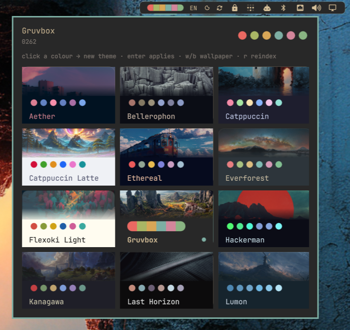
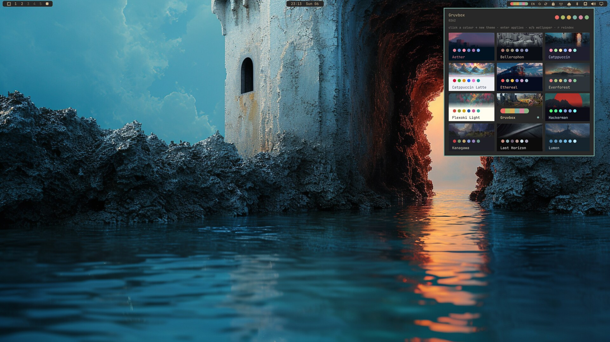

# amh.palette

An Omarchy shell bar widget that turns theme switching into a colour decision.

The bar shows the active theme's palette as small circles. Hovering (or opening
the popup) morphs them into a single continuous capsule; a theme switch
crossfades the colours in place. The popup lists every installed theme as a card
with its own palette circles **and the wallpaper that switching will actually
apply** — picked by matching every wallpaper's palette against the theme palette
in OKLab.





## Install

```bash
omarchy plugin add https://github.com/janooh37-hue/omarchy-plugin-palette --enable
```

`--enable` adds `{ "id": "amh.palette" }` to the `right` section of the bar in
`~/.config/omarchy/shell.json`. To place it yourself instead:

```bash
omarchy plugin add https://github.com/janooh37-hue/omarchy-plugin-palette
omarchy plugin enable amh.palette --section right
```

The shell hot-reloads; the widget appears without a restart. Build the wallpaper
palette index once (about 25s for ~1000 wallpapers, then cached):

```bash
~/.config/omarchy/plugins/amh.palette/bin/palette index --rebuild
```

## Removal

```bash
omarchy plugin remove amh.palette
rm -rf ~/.cache/amh-palette
```

`omarchy plugin remove` deletes the plugin directory and drops the widget from
`shell.json`. The second command clears the wallpaper palette cache. Themes and
wallpapers the plugin applied stay as they are; the background symlinks it wrote
live in `~/.config/omarchy/backgrounds/<theme>/palette-*` and can be deleted
with `rm ~/.config/omarchy/backgrounds/*/palette-*`.

## Requirements

| Dependency | Why | Where it comes from |
|---|---|---|
| Omarchy 4 (Quattro) shell | plugin host | ships with Omarchy |
| `aether` | palette extraction and theme generation | Arch package `aether` (install it with your package manager) |
| `python3` ≥ 3.11 | `bin/palette` engine (`tomllib`) | ships with Arch |

The plugin never installs anything itself; install `aether` yourself before
enabling the widget.

Nothing is downloaded at runtime. `bin/palette` only reads theme `colors.toml`
files and your wallpapers, and shells out to `aether`, `omarchy-theme-set`,
`omarchy-theme-bg-set` and `omarchy-theme-bg-current` with argument lists (no
shell interpolation).

## Layout

```
manifest.json      bar-widget plugin manifest (id: amh.palette)
Palette.qml        widget + popup (root type: qs.Ui.Panel)
PaletteDots.qml    the morphing circle row
PaletteData.js     colors.toml parsing + label helpers
bin/palette        palette engine (index / map / match / apply)
```

## Interactions

Bar widget:

| Input | Action |
|---|---|
| hover | morph circles → capsule, tooltip `<theme> — <wallpaper>` |
| left click | open the theme popup |
| right click | next palette-matched wallpaper |
| middle click | random palette-matched wallpaper |
| scroll | next / previous matched wallpaper |

Popup:

| Input | Action |
|---|---|
| click a theme card | apply that theme + its best matched wallpaper |
| right click the current card | next matched wallpaper |
| click a colour in the header row | generate a whole new theme from that colour (aether) |
| arrows / hjkl | move the card cursor |
| enter / space | apply the selected theme |
| `w` / `b` | next / previous matched wallpaper |
| `r` | rebuild the wallpaper palette index |
| esc | close |

IPC (`omarchy-shell amh.palette <method> [arg]`):
`open`, `close`, `toggle`, `apply <theme>`, `wallpaper <best|next|prev|random>`,
`generate <#hex>`, `reindex`, `morph`.

## How matching works

`bin/palette` asks `aether --extract-palette --json` for each wallpaper in
`~/Pictures/wallpapers/active_theme` (override with `AMH_PALETTE_WALLPAPERS`)
and caches the 16-colour result in `~/.cache/amh-palette/index.json`, keyed by
mtime+size. Cold indexing of ~1000 wallpapers takes ~25s at 16 jobs; warm runs
are ~0.1s.

A wallpaper's cost against a theme is computed in OKLab:

- **accent cost** — mean over the theme's `red green yellow blue magenta cyan`
  of the distance to the nearest wallpaper accent slot (lightness weighted 1.6,
  because hue mismatch reads louder than lightness mismatch),
- **background cost** — theme `background` vs the wallpaper's background slot
  (weight 0.75),
- **saturation agreement** — |mean theme chroma − mean wallpaper chroma|
  (weight 1.5), which stops a grey wallpaper from winning a vivid theme just by
  being "not far" from every accent,
- **mode penalty** — 0.35 when a dark theme meets a light wallpaper or vice
  versa.

The per-theme top 12 is cached in `~/.cache/amh-palette/map.json` and
invalidated by an index signature, so the popup can show previews instantly.

## Legibility rules

A theme palette is authored against *its own* background, so anything painted on
a different surface has to be re-checked or it renders invisible. Helpers live in
`PaletteData.js` (`contrast`, `legible`, `visible`) and are WCAG
relative-luminance based; fixes are hue-preserving (the colour is mixed toward
white/black only until it clears the ratio).

| Surface | Painted with | Minimum |
|---|---|---|
| card band (solid theme background) | theme `foreground` | 4.5 |
| card border / current marker | theme `accent` | 2.2 |
| card + header + bar swatches | palette colours | 1.9 (seen, not read) |
| popup title | `Color.popups.text` | 4.5 |
| popup captions | `Color.muted` | 3.0 |

Theme cards keep the wallpaper preview in the top band only. Text never sits on
a photo — a light theme over a bright wallpaper used to render its label at
1.0:1.

## What applying a theme does

`palette apply <slug>`:

1. symlinks the top 12 matches into `~/.config/omarchy/backgrounds/<slug>/` as
   `palette-NN.<ext>` (replacing the previous `palette-*` links), so omarchy's
   own `omarchy-theme-bg-next` and background switcher cycle inside the matched
   set;
2. runs `omarchy-theme-set <slug>` with `OMARCHY_THEME_SKIP_BACKGROUND=1`, so
   the palette hot-swaps without omarchy choosing its own background;
3. runs `omarchy-theme-bg-set <match>` for the crossfade.

`palette from-color '#rrggbb'` instead finds the wallpaper that carries that
colour most convincingly and hands it to `aether --generate`, which builds and
applies a fresh theme from it.

Every one of these actions is user-initiated (click, key, or IPC call). The
plugin writes nothing on load beyond its own cache under
`~/.cache/amh-palette/`.

## CLI

```
palette themes                  # installed themes + swatches (JSON)
palette current                 # active theme + swatches (JSON)
palette index [--rebuild]       # refresh the wallpaper palette cache
palette map [--refresh]         # per-theme matched wallpapers (JSON)
palette match --theme gruvbox -n 5
palette match --color '#d3869b' -n 5
palette apply gruvbox [--pick best|next|prev|random] [--keep-wallpaper]
palette wallpaper [theme] [--pick next]
palette from-color '#d3869b' [--light] [--mode <aether-extract-mode>]
```

## Settings

Inline keys on the `shell.json` layout entry:

```json
{ "id": "amh.palette", "dots": 6, "dotSize": 7, "columns": 3, "rows": 4, "autoIndex": true }
```

`dots` swatch count (2-8) · `dotSize` circle diameter before text scaling ·
`columns`/`rows` popup grid · `autoIndex` refresh the wallpaper cache ~8s after
login.

## License

[MIT](LICENSE)
